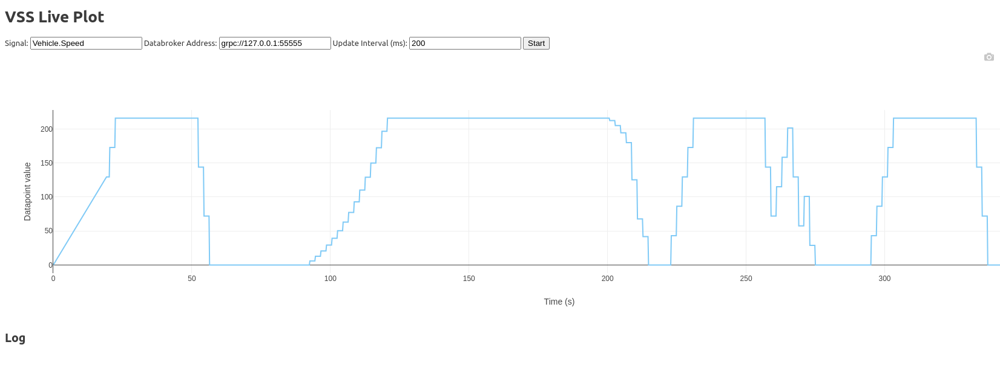

# VSS Live Plot (VS Code Extension)

This is a basic webview extension that can be used for monitoring the values of VSS signals going through the Kuksa Databroker.
It can also serve as example on how to compile the Kuksa protobufs to typescript and setup simple message-based communcation
between the databroker and the webview.




# Setup

```text
---------------                    ------------------                       ---------------------
|             |                    |                |                       |                   |
|    Kuksa    |        GRPC        |   VSCode Ext   |    VSCode Message     |   VsCode Webivew  |
|  Databorker |  <===============> |  Host (NodeJS) | <=================>   |   (Plotly Trace)  |
|             |                    |                |       Passing         |                   |
---------------                    ------------------                       ---------------------
```

The webview uses Plotly (included under `media/plotly.min.js`). To draw and manipulate the actual plot.

# Compiling

## Compiling the protobufs

Protobufs for the communication come pre-compiled but if you wish to re-compile them, run:

Check-out the kuksa.val submodule:

```shell
git submodule update --init --recursive
```

Remove the old protobufs:

```shell
rm -rf src/proto_gen
```

And run the `./protogen.sh` script from the repository root.


## Compiling and running the extension

Run

```shell
npm run watch
```

And then press <kbd>F5</kbd> to open the extension debug host.

In the extension debug host window, open the VSCode Console (<kbd>Ctrl</kbd> + <kbd>Shift</kbd> + <kbd>P</kbd>) and start typing
```VSS Live Plot``` in the pop-up.  Select the extension command with the arrow keys and press <kbd>Enter</kbd>. You should now 
see a screen similar to the one in the screenshot at the beginning of the readme. (without the plot).

Configure the signal you want to monitor and how often the extension should poll the databroker and press `Start`.


